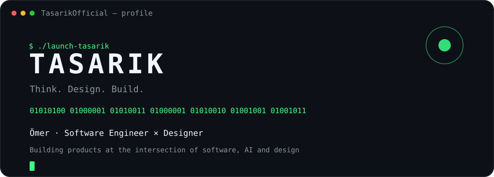

<p align="center">
  
</p>

## `~/ whoami`

Hi, I'm **Ömer** — a software engineer & designer building products at the intersection of **software, AI and design**.

Currently building **TasariKAI**.

```txt
> artificial intelligence
> ui / ux
> web development
> creative coding
> robotics
> open source
```

---

## `~/ toolbox`

<p>
  
</p>

---

<p align="center">
  
</p>

---

## `~/ contribution-calendar`

<p align="center">
  
</p>

---

## `~/ the-numbers`

<p align="center">
  
  
</p>

---

## `~/ currently-building`

### TASARIKAI

> **Düşün, Sor, Üret.**

AI-powered design platform focused on turning ideas into polished digital products.

**tasarik.com**

---

## `~/ selected-work`

| Project | What it is |
|---|---|
| **TasariKAI** | AI-powered design platform |
| **Mini Bot** | Desktop AI companion / robotics experiment |
| **TinyPulse** | Small experimental web project |

---

<p align="center">
  <code>TASARIK © 2026</code><br><br>
  <sub>Build things people want to use.</sub>
</p>
